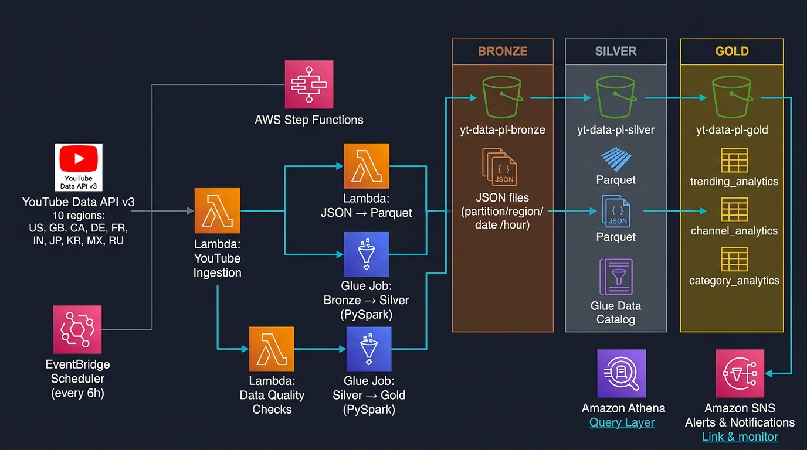
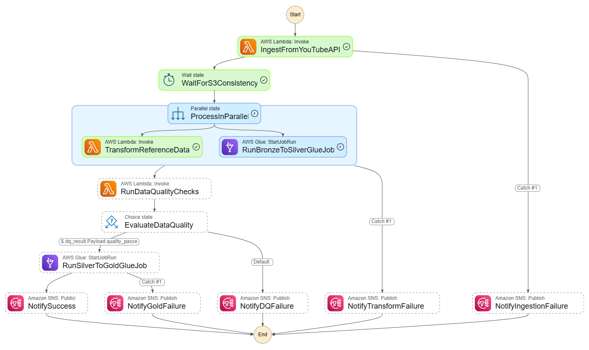

# 🎬 YouTube Trending Data Pipeline — AWS Serverless

<div align="center">


**Pipeline de Data Engineering serverless en AWS que ingesta, transforma y agrega datos de tendencias de YouTube en tiempo real usando arquitectura Medallion (Bronze → Silver → Gold).**

[Ver Diagrama Interactivo](./architecture.html) · [Arquitectura](#arquitectura) · [Pipeline Walkthrough](#pipeline-walkthrough) · [Capa Gold](#capa-gold--tablas-analíticas)

</div>

---

## 📋 Descripción General

Este proyecto implementa un **pipeline de Data Engineering end-to-end** completamente automatizado en AWS que:

- **Ingesta** datos en vivo de la [YouTube Data API v3](https://developers.google.com/youtube/v3) — videos en tendencia y categorías — para **10 países** (US, GB, CA, DE, FR, IN, JP, KR, MX, RU)
- **Transforma** los datos a través de 3 capas de calidad creciente siguiendo la **arquitectura Medallion**
- **Valida** la calidad de los datos automáticamente antes de promoverlos a la capa analítica
- **Agrega** métricas de negocio listas para consumo (engagement, ranking de canales, cuota de categorías)
- **Orquesta** todo el flujo con retry logic y alertas vía **AWS Step Functions**

### Problemática que resuelve

El análisis de tendencias en YouTube es valioso para creadores de contenido, marcas y analistas, pero los datos públicos disponibles son snapshots históricos de Kaggle que no reflejan el estado actual de la plataforma. Este pipeline resuelve eso con **datos frescos cada 6 horas, particionados, limpios y listos para consultar con SQL estándar.**

---

## 🏗️ Arquitectura



> 💡 Para una versión **interactiva** con tooltips y detalles de cada componente, abre [`architecture.html`](./architecture.html) en tu navegador.

### Vista del Step Functions State Machine



---

## ☁️ Servicios AWS Utilizados

| Servicio | Rol en el Pipeline | Detalle |
|---|---|---|
| **AWS Step Functions** | Orquestación | State machine con 7 estados, retry logic, parallel branches y error handling |
| **Amazon EventBridge** | Trigger | Scheduler `cron(0 */6 * * ? *)` — dispara el pipeline cada 6 horas |
| **Amazon EventBridge** | Trigger (config. externa) | Scheduler `cron(0 */6 * * ? *)` que dispara el pipeline cada 6 horas. **⚠ No está implementado en el código del repo** — se configura manualmente en la consola AWS o vía CLI (ver sección Getting Started). El pipeline también puede ejecutarse directamente desde la consola de Step Functions. |
| **AWS Lambda** | Cómputo serverless | 3 funciones: ingesta, conversión JSON→Parquet, data quality checks |
| **AWS Glue** | ETL distribuido | 2 jobs PySpark: Bronze→Silver y Silver→Gold |
| **Amazon S3** | Almacenamiento | 3 buckets por capa (bronze, silver, gold) con particionado Hive-style |
| **AWS Glue Data Catalog** | Metastore | 3 databases (bronze, silver, gold) con schema inference y actualización automática |
| **Amazon Athena** | Consulta SQL | Motor serverless para queries sobre Parquet en S3; usado por la Lambda de DQ |
| **Amazon SNS** | Alertas | Notificaciones en 4 estados: success, ingestion failure, transform failure, DQ failure |
| **AWS IAM** | Seguridad | 3 políticas de mínimo privilegio (Lambda, Glue, Step Functions) |
| **AWS Secrets Manager** | Seguridad | Almacenamiento seguro de la YouTube API key |

---

## 🔄 Pipeline Walkthrough

El pipeline está orquestado completamente por **AWS Step Functions** y se compone de los siguientes estados:

### Estado 1 — `IngestFromYouTubeAPI` (Lambda)

La Lambda `yt-data-pipeline-youtube-ingestion-dev` es invocada por Step Functions (y también scheduleable directamente por EventBridge).
La Lambda `yt-data-pipeline-youtube-ingestion-dev` es invocada por Step Functions como primer estado del State Machine. El pipeline completo se puede disparar de tres formas: (1) automáticamente vía **Amazon EventBridge Scheduler** con `cron(0 */6 * * ? *)` — *configurado externamente en la consola AWS o CLI, no implementado en el código de este repositorio*; (2) manualmente desde la consola de Step Functions; (3) directamente invocando la Lambda.

Para cada una de las **10 regiones configuradas**:
1. Llama a `GET /videos?chart=mostPopular&part=snippet,statistics,contentDetails&regionCode={r}&maxResults=50`
2. Llama a `GET /videoCategories?part=snippet&regionCode={r}` (referencia de categorías)
3. Añade `_pipeline_metadata` (ingestion_id, timestamp, video_count, region, source)
4. Escribe JSON en S3 Bronze con **particionado Hive-style**:
   ```
   s3://yt-data-pl-bronze/youtube/raw_statistics/region={r}/date={YYYY-MM-DD}/hour={HH}/{timestamp}.json
   s3://yt-data-pl-bronze/youtube/raw_statistics_reference_data/region={r}/date={d}/{r}_category_id.json
   ```
5. Si alguna región falla: registra el error, publica alerta SNS y continúa con las demás

### Estado 2 — `WaitForS3Consistency` (Wait)

Espera de 10 segundos para garantizar la consistencia eventual de S3 antes de que los jobs de transformación intenten leer los nuevos objetos.

### Estado 3 — `ProcessInParallel` (Parallel)

Ejecuta **dos ramas en paralelo** para optimizar el tiempo total del pipeline:

#### Rama A — `TransformReferenceData` (Lambda)
La Lambda `json_to_parquet` procesa los archivos JSON de categorías:
1. Lee el JSON desde S3 Bronze con `boto3` (evita problemas de tipos mixtos con `pandas`)
2. Aplana el array `items` con `pd.json_normalize()`
3. Valida columnas requeridas (`id`, `snippet.title`)
4. Elimina categorías duplicadas por `id`
5. Escribe Parquet en Silver via `awswrangler.s3.to_parquet()` con `mode="overwrite_partitions"` (idempotente)
6. Actualiza el **Glue Data Catalog** automáticamente (`database: yt-pipeline-silver-dev`, `table: clean_reference_data`)

#### Rama B — `RunBronzeToSilverGlueJob` (Glue PySpark)
El Glue Job `bronze_to_silver_statistics` ejecuta un ETL completo en PySpark:
1. **Lectura**: Desde el Glue Catalog con `push_down_predicate` por región (evita escanear datos innecesarios)
2. **Schema enforcement**: Detección automática de formato (YouTube API JSON vs CSV Kaggle legacy) con selección y casteo de columnas
3. **Cleansing**:
   - Filtra registros sin `video_id`
   - Normaliza `region` a minúsculas
   - Parsea `trending_date` soportando dos formatos (`yy.dd.MM` y estándar)
   - Rellena nulos en columnas numéricas con 0
4. **Feature engineering**:
   - `like_ratio = likes / views * 100`
   - `engagement_rate = (likes + dislikes + comments) / views * 100`
5. **Deduplicación**: Window function `ROW_NUMBER()` sobre `(video_id, region, trending_date_parsed)` — mantiene el registro más reciente
6. **Data quality inline**: Cuenta nulos en columnas críticas y values negativos; loguea warnings
7. **Escritura**: Parquet Snappy particionado por `[region, trending_date_parsed]` — actualiza el Glue Catalog

### Estado 4 — `RunDataQualityChecks` (Lambda)

La Lambda `data_quality` ejecuta **5 tipos de validaciones** sobre las tablas Silver via Athena (`awswrangler.athena.read_sql_query` sobre una muestra de 10,000 filas):

| Check | Descripción | Umbral |
|---|---|---|
| `row_count` | Cantidad mínima de registros | ≥ 10 filas |
| `null_pct` | % de nulos en columnas críticas | ≤ 5% |
| `schema` | Columnas requeridas presentes | 0 columnas faltantes |
| `value_range` | Views negativos o extremos (>50B) | 0 anomalías |
| `freshness` | Datos recientes | Último registro < 48h |

Retorna `{"quality_passed": true/false}` para el siguiente estado de evaluación.

### Estado 5 — `EvaluateDataQuality` (Choice)

Estado de **decisión condicional**: si `quality_passed == true`, avanza al Gold job. Si no, redirige a `NotifyDQFailure` y termina el pipeline sin generar datos Gold incorrectos.

### Estado 6 — `RunSilverToGoldGlueJob` (Glue PySpark)

El Glue Job `silver_to_gold_analytics` genera **3 tablas analíticas Gold**:

Ver detalles en la sección [Capa Gold](#capa-gold--tablas-analíticas).

### Estado 7 — `NotifySuccess` / Handlers de Error (SNS)

En cualquier estado de falla o al finalizar exitosamente, Step Functions publica un mensaje en el topic SNS `yt-data-pipeline-alerts-dev`. Los handlers de error cubren: ingesta, transformación paralela, data quality y Gold job.

---

## 🥇 Capa Gold — Tablas Analíticas

Las tablas Gold están en `s3://yt-data-pl-gold/youtube/` y son consultables vía **Amazon Athena** (base: `yt-pipeline-gold-dev`).

### `trending_analytics` — KPIs Diarios por Región

Particionada por `[region, trending_date_parsed]`.

| Columna | Descripción |
|---|---|
| `total_videos` | Videos en tendencia ese día |
| `total_views` | Vistas agregadas del día |
| `total_likes` / `total_comments` | Engagement total |
| `avg_views_per_video` | Promedio de vistas por video |
| `avg_like_ratio` | Ratio de likes promedio (%) |
| `avg_engagement_rate` | (likes+dislikes+comments)/views (%) |
| `max_views` | Video con más vistas del día |
| `unique_channels` / `unique_categories` | Diversidad de contenido |

### `channel_analytics` — Ranking de Canales por Región

Particionada por `[region]`.

| Columna | Descripción |
|---|---|
| `total_videos` / `total_views` | Acumulado del canal |
| `avg_engagement_rate` | Tasa de engagement promedio |
| `peak_views` | Máximo de vistas en un video |
| `times_trending` | Cuántas veces apareció en trending |
| `first_trending` / `last_trending` | Primera y última aparición |
| `categories` | Categorías del canal (concat) |
| `rank_in_region` | Ranking por total de vistas en la región |

### `category_analytics` — Cuota de Vistas por Categoría

Particionada por `[region, trending_date_parsed]`.

| Columna | Descripción |
|---|---|
| `video_count` | Videos en trending de esa categoría |
| `total_views` / `total_likes` | Engagement de la categoría |
| `avg_engagement_rate` | Engagement promedio |
| `unique_channels` | Canales únicos en la categoría |
| `view_share_pct` | % de vistas totales del día en esa región |

---

## 🗂️ Estructura del Proyecto

```
youtube_trending_project/
│
├── 📄 architecture.html          # Diagrama interactivo (dark mode, AWS style)
├── 🖼️ architecture.jpg           # Imagen estática del diagrama de arquitectura
├── 🖼️ stepfunctions_graph.png    # Grafo visual del State Machine
│
├── lambda/
│   ├── youtube_ingestion/
│   │   └── lambda_function.py    # Ingesta desde YouTube Data API v3
│   └── json_to_parquet/
│       └── lambda_function.py    # Conversión JSON referencia → Silver Parquet
│
├── glue_jobs/
│   ├── bronze_to_silver_statistics.py   # ETL PySpark: Bronze → Silver
│   └── silver_to_gold_analytics.py      # Agregaciones PySpark: Silver → Gold
│
├── data_quality/
│   └── data_quality_lambda.py    # 5 checks de calidad sobre Silver vía Athena
│
├── step_functions/
│   └── pipeline_orchestration.json     # ASL definition del State Machine
│
├── iam_permissions/
│   ├── yt-data-pipeline-lambda-access-policy.json
│   ├── yt-data-pipeline-glue-access-policy.json
│   └── yt-data-pipeline-stepfunction-access-policy.json
│
├── scripts/
│   ├── aws_copy.sh               # Script para carga inicial de datos Kaggle
│   └── information.md            # Nombres de recursos AWS del proyecto
│
└── data/                         # Datos Kaggle históricos (seed inicial)
    ├── USvideos.csv, GBvideos.csv, ...
    └── US_category_id.json, ...
```

---

## 🚀 Getting Started

### Pre-requisitos

- Cuenta de AWS con permisos para crear Lambda, Glue, S3, Step Functions, SNS, IAM
- [AWS CLI](https://aws.amazon.com/cli/) configurado (`aws configure`)
- Python 3.10+
- YouTube Data API v3 key ([Google Cloud Console](https://console.cloud.google.com/))

### 1. Crear los Buckets S3

```bash
aws s3 mb s3://yt-data-pl-bronze --region us-east-1
aws s3 mb s3://yt-data-pl-silver --region us-east-1
aws s3 mb s3://yt-data-pl-gold   --region us-east-1
aws s3 mb s3://yt-data-pl-scripts-dev --region us-east-1
```

### 2. Subir los Glue Jobs a S3

```bash
aws s3 cp glue_jobs/bronze_to_silver_statistics.py s3://yt-data-pl-scripts-dev/glue_jobs/
aws s3 cp glue_jobs/silver_to_gold_analytics.py    s3://yt-data-pl-scripts-dev/glue_jobs/
```

### 3. Crear el Topic SNS

```bash
aws sns create-topic --name yt-data-pipeline-alerts-dev --region us-east-1
# Suscribir tu email al topic para recibir alertas
aws sns subscribe --topic-arn <ARN> --protocol email --notification-endpoint tu@email.com
```

### 4. Configurar las Lambdas

Crear las 3 funciones Lambda con las siguientes variables de entorno:

**`yt-data-pipeline-youtube-ingestion-dev`**
```
YOUTUBE_API_KEY=<tu_api_key>
S3_BUCKET_BRONZE=yt-data-pl-bronze
YOUTUBE_REGIONS=US,GB,CA,DE,FR,IN,JP,KR,MX,RU
SNS_ALERT_TOPIC_ARN=<tu_sns_arn>
```

**`yt-data-pipeline-json-to-parquet-dev`**
```
S3_BUCKET_SILVER=yt-data-pl-silver
GLUE_DB_SILVER=yt-pipeline-silver-dev
GLUE_TABLE_REFERENCE=clean_reference_data
SNS_ALERT_TOPIC_ARN=<tu_sns_arn>
```

**`yt-data-pipeline-data-quality-dev`**
```
S3_BUCKET_SILVER=yt-data-pl-silver
SNS_ALERT_TOPIC_ARN=<tu_sns_arn>
DQ_MIN_ROW_COUNT=10
DQ_MAX_NULL_PERCENT=5.0
```

> **Nota**: La Layer `awswrangler` debe estar adjunta a las funciones que la usan (`json_to_parquet` y `data_quality`). Disponible como [AWS Managed Layer](https://aws-sdk-pandas.readthedocs.io/en/stable/layers.html).

### 5. Crear los Glue Jobs

En la consola de AWS Glue, crear 2 jobs con tipo **Spark** apuntando a los scripts en S3:

- `yt-data-pipeline-bronze-to-silver-dev` → `s3://yt-data-pl-scripts-dev/glue_jobs/bronze_to_silver_statistics.py`
- `yt-data-pipeline-silver-to-gold-dev` → `s3://yt-data-pl-scripts-dev/glue_jobs/silver_to_gold_analytics.py`

### 6. Desplegar el State Machine

Actualiza los ARNs en `step_functions/pipeline_orchestration.json` (reemplaza `YOUR-ID-ACCOUNT`), luego:

```bash
aws stepfunctions create-state-machine \
  --name yt-data-pipeline-orchestration-dev \
  --definition file://step_functions/pipeline_orchestration.json \
  --role-arn <arn_del_rol_step_functions>
```

### 7. (Opcional) Carga inicial con datos Kaggle

Si deseas sembrar el pipeline con datos históricos de [Kaggle YouTube Trending Dataset](https://www.kaggle.com/datasets/datasnaek/youtube-new):

```bash
bash scripts/aws_copy.sh
```

### 8. Configurar EventBridge para automatización

```bash
aws events put-rule \
  --name yt-pipeline-trigger \
  --schedule-expression "cron(0 */6 * * ? *)" \
  --state ENABLED
```

---

## 🔒 Seguridad & IAM

El proyecto implementa el principio de **mínimo privilegio** con 3 políticas IAM:

| Rol | Permisos |
|---|---|
| **Lambda Role** | S3 read/write en bronze/silver + Glue catalog CRUD + SNS publish + Athena StartQuery |
| **Glue Role** | S3 read/write en todos los buckets + Glue catalog full + CloudWatch Logs |
| **Step Functions Role** | Lambda:InvokeFunction + Glue:StartJobRun + SNS:Publish — solo los recursos del pipeline |

Las políticas completas están en [`iam_permissions/`](./iam_permissions/).

---

## 📡 Monitoreo & Alertas

El pipeline envía notificaciones SNS en los siguientes eventos:

| Evento | Severidad | Descripción |
|---|---|---|
| Pipeline completado | ✅ INFO | Todas las capas actualizadas correctamente |
| Falla en ingesta | ❌ ERROR | La Lambda de ingesta no pudo completar todas las regiones |
| Falla en transformación | ❌ ERROR | Alguna rama del procesamiento paralelo falló |
| Data Quality falló | ⚠️ WARNING | Los checks de calidad no pasaron — Gold no fue actualizado |
| Falla en Gold | ❌ ERROR | El Glue Job de Gold falló después de que DQ pasó |

Todos los logs están disponibles en **Amazon CloudWatch Logs** bajo los grupos de cada Lambda y Glue Job.

---

## 🧪 Calidad de Datos

La arquitectura implementa **doble capa de validación**:

1. **Inline en PySpark** (Glue Job Bronze→Silver): checks de nulos, valores negativos y conteos que se registran en CloudWatch
2. **Lambda DQ dedicada** (después del Silver): 5 checks formales que actúan como **gate** obligatorio antes de construir la capa Gold

Esto garantiza que la capa Gold siempre contenga datos confiables.

---

## 🔭 Posibles Mejoras

- [ ] Integración con **AWS Glue Data Quality** (DQDL) para reglas declarativas
- [ ] Dashboard en **Amazon QuickSight** conectado a las tablas Gold via Athena
- [ ] **Terraform / CDK** para infraestructura como código (IaC)
- [ ] Ampliar a más regiones y mayor frecuencia de ingesta
- [ ] Añadir análisis de sentimiento sobre títulos con **Amazon Comprehend**
- [ ] Exportación a **Amazon Redshift** para workloads de BI más complejos
- [ ] Tests unitarios para las transformaciones PySpark con `pytest` + `chispa`
- [ ] Detección de anomalías con **Amazon Lookout for Metrics** sobre la capa Gold

---

## 📄 Licencia

Este proyecto es de código abierto bajo la licencia **MIT**. Ver [LICENSE](./LICENSE) para más detalles.

---

<div align="center">

Construido con ❤️ usando AWS Serverless · Python · PySpark · Arquitectura Medallion

⭐ Si este proyecto te fue útil, ¡dale una estrella al repo!

</div>

